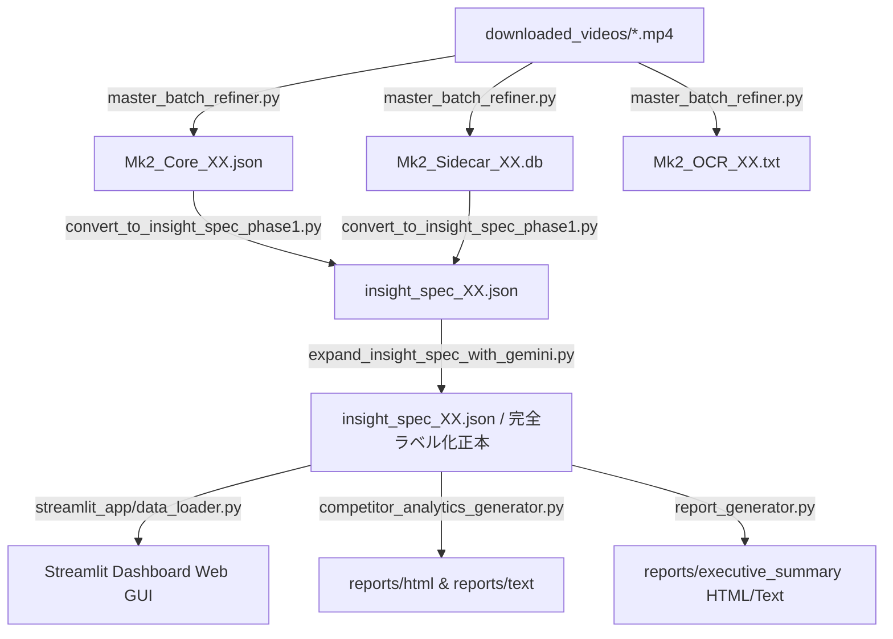

# 納品データ仕様および AI 活用ガイド (社内用詳細資料)

本ドキュメントは、本システムから生成される納品物（`archive/` ディレクトリ内のデータ群）の実データ監査結果と、リポジトリ側の生成・参照コードベースの突き合わせ結果を整理し、AI（ChatGPT や Gemini 等）と連携した際のデータ活用価値、現状の限界、および開発のロードマップを明文化した社内向け技術ガイドです。

---

## 1. 納品データ実態インベントリ

`archive/` 配下の実データを調査した結果、納品データセットは以下の 4 種類のファイル群から構成されていることが確認されました。

### ① `insight_spec_{id}.json` (01〜05) 【主・最終正本】
- **役割**: 動画の全メタデータ、Gemini LLM で高度に分類されたラベル情報、再生数やエンゲージメント等の時系列統計情報を内包した、本システムにおける **「唯一の正本（シングルソース）」**。
- **データ構造**:
  - `video_meta`: 動画ID、チャンネルID、タイトル、URL、公開日時
  - `knowledge_core`: `center_pins` リスト。各 center_pin には `element_id`, `type`, `content`, `base_purity_score` と、Gemini が自動付与した分類ラベル `labels` (`business_theme`（配列）、`funnel_stage`、`difficulty`) を内包。
  - `views`:
    - `competitive`: 時系列再生数・エンゲージメント推移 (`snapshot_history`)、統計値 (`metrics`)、高エンゲージメントピン (`top_pins_by_engagement`)
    - `education`: 難易度別分布 (`difficulty_distribution`)
    - `self_improvement`: テーマ分布 (`business_theme_distribution`)、ファネル分布、ファネル遷移フロー (`funnel_flow`)
- **AI 適合性**: **極めて高い**。最も構造化されており、AIにそのまま食べさせるだけで、嘘（ハルシネーション）を排除した正確なビジネスレポートを動的に作成させることができます。

### ② `Mk2_Core_{id}.json` (01〜05) 【中間生成物】
- **役割**: 音声認識（Whisper）と OCR (EasyOCR) を元に抽出された 1 次の「知識要素」データ。
- **データ構造**: `lecture_id`, `video_path`, `generated_at`, および `center_pins` リスト。
- **AI 適合性**: **中**。Gemini による高度な分類ラベルが付与される前の生データであり、上位の `insight_spec` の中にほぼ全て包含されているため、AI 連携時の単独利用は推奨されません。

### ③ `Mk2_OCR_{id}.txt` (01〜05) 【中間生成物】
- **役割**: 動画から EasyOCR で抽出された画面テキストの Raw 連結データ（改行・スペースなしの1行テキスト）。
- **AI 適合性**: **低**。スライドなどに含まれていた生の文字列情報であり、必要に応じてキーワード検索などに活用する以外の用途は薄いです。

### ④ `Mk2_Sidecar_{id}.db` (01〜05) 【補助・現状制約あり】
- **役割**: 各 center_pin が動画内の「いつ」出現するかを記録したエビデンス（証拠）インデックス SQLite データベース。
- **テーブル名**: `evidence_index` (1テーブルのみ)
- **カラム構成**: `element_id` (TEXT), `start_ms` (INTEGER), `end_ms` (INTEGER), `visual_text` (TEXT), `visual_score` (REAL), `source_video_path` (TEXT)
- **AI 適合性**: **低（現段階での制約あり）**。

---

## 2. 調査で判明した「重大な制約と不整合」

実データファイルの解析とコードベースの裏付け突き合わせにより、以下の **プレースホルダー仕様** および **ファイル欠損** が明らかになりました。

### 2.1 Sidecar DB (`Mk2_Sidecar_*.db`) の時間情報プレースホルダー仕様
- **実データの事実**:
  - すべてのデータベース（01〜05）のすべてのレコードにおいて、出現ミリ秒である `start_ms` および `end_ms` は **一律 `(0, 0)`** に設定されています。
  - `visual_text` には、一律で **動画全体から OCR 抽出したテキストの先頭 500 文字 (`visual_text[:500]`) がそのまま登録されて重複** しています。
- **コードベースの裏付け**:
  - `scripts/master_batch_refiner.py` の 363〜370 行目の保存処理を確認したところ、以下のようにハードコーディングされていました。
  ```python
  for pin in pin_data.get("center_pins", []):
      cursor.execute(
          "INSERT INTO evidence_index VALUES (?, ?, ?, ?, ?, ?)",
          (pin.get("element_id"), 0, 0, visual_text[:500], pin.get("base_purity_score", 0), str(video_path))
      )
  ```
- **結論と対応**:
  - 現行の Sidecar DB にはミリ秒単位の具体的な出現時間位置は記録されていません（データ構造上のプレースホルダー）。
  - docs/README において **「時間精度は未対応（プレースホルダー値）」** であることを制約として明記し、AI に「この概念は動画の何分何秒で話されているか」を質問しても現状は正しく回答できない旨をドキュメント化する必要があります。

### 2.2 設定ファイル `executive_report.json` の欠損
- **実データの事実**:
  - `streamlit_app/config.py` に `EXEC_REPORT_PATH` として定義されている `D:/AI_スクリプト成果物/video-insight-spec/data/executive_report.json` は、**実ファイルとしてプロジェクト内および `archive/` に存在せず、欠損しています**。
- **対応**:
  - ダッシュボードの全体診断は、`insight_spec` 群を直接ロードして合算集計するロジック（`AnalyticsEngine` 経由）に寄せることで回避可能です。

---

## 3. 実データとコードの対応関係（データフロー）



---

## 4. 現行データを用いた AI 活用可能性評価

最終正本である `insight_spec_{id}.json` を主たる AI 活用データと位置づけることで、以下の範囲で極めて高精度な AI 活用が可能です。

### 4.1 AI で実行可能なことの一覧
- **勝ちパターン抽出**:
  - 難易度やコンテンツタイプ別のエンゲージメント率を集計し、視聴者反応の良かったパターン（型）を抽出。
- **競合比較**:
  - スナップショット履歴（`snapshot_history`）を活用し、複数動画間の再生数増加量・成長率を AI に自動計算・比較させる。
- **ビジネステーマ分析**:
  - テーマ分布 (`business_theme_distribution`) から、自社チャンネルの強みテーマと手薄なテーマを自動で棚卸しさせる。
- **構成・企画示唆**:
  - `funnel_flow` を元に、ファネルの「穴（手薄なステージ）」を特定し、次に作るべき新動画の企画タイトル案を自動提案させる。
- **経営者向けサマリー・レポート要約**:
  - 複雑なデータを A4 1枚相当の要約テキストへ瞬時に変換させる。

### 4.2 「バズる型を抽出して」の実現可能性評価
- **定性的・傾向の抽出**: **【可能（信頼度：高）】**
  - 高エンゲージメントな center_pins の `content` テキストを AI が比較分析し、「3C分析などのフレームワークを初心者に分かりやすく噛み砕いて伝えるパターンが最も高反応である」といった勝ち筋・傾向を導き出すことができます。
- **定量的・完全再現モデルの抽出**: **【不可 / 制約あり】**
  - 現行データには、個々の center_pin 単位の「CTR（クリック率）」や「視聴維持カーブの推移」「離脱点」といったミクロな動的メトリクスが含まれていません。
  - したがって、これは完全再現性のある「バズる方程式」ではなく、あくまで **「勝ち筋の仮説（コンテンツ傾向の抽出）」** として扱う必要があります。

---

## 5. ロードマップ（将来の価値向上への余地）

1. **タイムスタンプの精緻化（DBの真の有効化）**:
   - `master_batch_refiner.py` の Whisper 処理において、`segments` から各センテンスの正確な開始秒・終了秒を取得し、Sidecar DB の `start_ms` / `end_ms` にマッピングします。これにより、AI が「何分何秒で話されているか」をピンポイントで回答・ジャンプできるようになります。
2. **アナリティクス実データの結合**:
   - YouTube Analytics API 等から視聴維持率カーブや離脱ポイントのデータを抽出し、`insight_spec` に結合させることで、「視聴者が飽きて離脱したシーン」を AI が特定・改善提案できるようにします。
