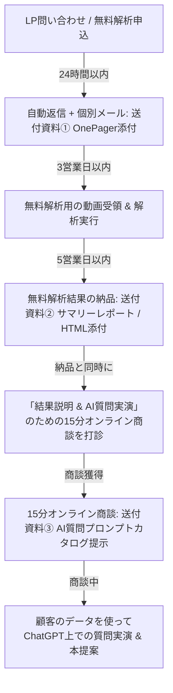

# LP・提案導線 改善提案書 (社内用)

本ドキュメントは、YouTube動画の高度構造化データ資産（`insight_spec`）の持つ真の価値を最大限に訴求するため、現行のランディングページ（`https://luvira.co.jp/lp/`）および問い合わせから商談化に至る「営業提案フロー」全体の改善案を整理した社内向け設計書です。

PR #21（事実整理）および PR #22（営業資料・提案OnePager・AI質問例カタログ）で整備された「AI接続前提の動画知識資産」というコンセプトを根底とし、顧客に「何が届き、どう使えるか」を明確に伝えるための戦略を提示します。

---

## 1. 現行LPの総評

現在のLPは、**「日本語特化AIによる揺らぎの正規化（168→6テーマ分類）」**という技術的・機能的側面が非常に美しく整理されており、BtoB向けの知的なトーン＆マナーが維持されています。しかし、営業現場で顧客に「自社にどう役立つか」を直感的に想起させるという点においては、いくつかの重要な改善余地があります。

### 現行LPの強み
- **明確な数値実績**: 「168→6テーマの正規化」「未分類率0%」「最短10日導入」などのファクトベースの実績値がファーストビューやバッジで印象的に提示されている。
- **優れた課題喚起**: 「コンテンツ制作」「動画制作」などテーマ名が揺れて手集計しているマーケターの日常的な「痛み」が極めて正確に言語化されている。
- **Before / After の高い視認性**: バラバラだったテーマが美しく6カテゴリに整理される流れが図示されており、技術の意義が分かりやすい。

### 現行LPの弱み（課題）
- **「納品物」が何かが抽象的**: 「分析レポート納品」「JSON形式でBIツール連携」という表記に留まっており、顧客が最終的に受け取る資産（`insight_spec.json`）の姿が見えにくい。
- **「AIでどう使えるか」の訴求不足**: JSONを受け取った後、ChatGPT等の生成AIに投げることで「動画を見返さずに質問し放題になる」「次に作るべき新動画の企画をAIに瞬時に出させる」という劇的な体験価値がLP内で全くアピールされていない。
- **CTA（行動喚起）の弱さと配置**: ファーストビューにCTAボタンが存在せず、無料解析の案内も最下部までスクロールしなければ到達しない。また、「無料で1本解析」という非常に強力なフック（オファー）の具体的メリットや進め方が十分に説明されていない。
- **FAQ（よくある質問）の欠如**: 顧客が導入判断をする上で疑問に感じる点（契約本数、セキュリティ、時間精度の限界、AI質問でできること）について答えるFAQセクションが一切存在しない。
- **技術指標の噛み砕き不足**: `Semantic Purity`（テーマ統一度）や `Quality Score` などの指標が、非技術者（マーケターや事業責任者）にとって「どうありがたいのか（AI回答の正確性に直結する）」が説明されていない。

---

## 2. 営業資料群とのギャップ

| 観点 | 営業資料・OnePager の価値基準 | 現行LPの実態 | 改善の方向性 |
| :--- | :--- | :--- | :--- |
| **納品物の定義** | AI対応型の動画知能データベース（`insight_spec.json`）の獲得。単なるレポートではなく、再利用できる「生きた知識資産」。 | テーマの正規化と集計、BI連携のためのJSON提供、レポート納品という「分析作業」が中心。 | 納品データが「いつでもAIと対話して知見を引き出せるデータベース」であることを明確にし、実ファイル（JSON）の存在価値を前面に出す。 |
| **AI活用の体験** | ChatGPTやGeminiにファイルをドラッグ＆ドロップするだけで、30種類の具体的な実務質問に数秒で答えてくれる。 | LP上での「AI活用」はルヴィラ社内でのデータ整理処理に留まっており、顧客自身がAIと対話する体験が語られていない。 | LP上に「AIへの具体的な質問例」を提示し、顧客が自社のデータで対話する具体的なイメージ（コピペで使える質問など）を持たせる。 |
| **時間情報の制約** | Sidecar DBの時間情報は現在 `(0, 0)` のプレースホルダー状態であり、秒単位のジャンプ質問は非対応であることを開示。 | 特に時間情報への言及や、何ができないか（制約）の記載がない。 | 誠実な技術開示として「秒単位のジャンプは次期ロードマップ。現在は動画・講座単位でのインサイト検索に特化」とFAQや注意点に明記し、信頼感を担保する。 |
| **バズる型** | 確実なバズの予測ではなく、「高反応傾向」「勝ち筋候補」のデータ的・仮説的な抽出。 | 「何が当たっているか、伸びる理由まで言語化」という見出しが、やや「バズを確定予測できる」と誤解される懸念。 | 誇張表現を排除し、「高反応だったコンテンツタイプとテーマの組み合わせから、強力な勝ち筋を抽出する」という現実的な価値に補正する。 |

---

## 3. LPに追加すべき価値訴求 & 改善設計

### A. ファーストビューの刷新
- **CTAの追加**: ファーストビュー内に直接「無料で1本お試し解析してみる」というCTAボタンを配置。
- **ターゲットの明確化**: メインコピーに「講座事業者・EdTech・自社メディア運用者」が直感的に「自分向けだ」とわかる文言をブレンド。
- **納品物のチラ見せ**: AI専用の構造化JSONがセットで納品されることをファーストビューから匂わせる。

### B. 「AI対応型・動画知能データベース」の納品価値を可視化
- レポートを納品されて終わりではなく、**「動画を見返さずにAIに聞くだけで知見を引き出せる資産」**が手に入ることを図示。
- 納品パッケージ（JSON、SQLite、エグゼクティブ要約）の具体的な役割をイラストやアイコンで提示。

### C. 信頼材料（技術スコア・匿名Before/After）の噛み砕き
- `Semantic Purity (テーマ統一度): 0.61` -> **「AIがハルシネーション（嘘）を起こさずに動画の文脈を100%正確に理解できる、ビジネス報告基準のデータ構造」**であることを解説。
- `Quality Score: 0.78` -> **「業界平均を遥かに上回る、Gemini LLMによる正確なファネル・難易度分類精度」**であることを意味づけ。
- 匿名事例として「168個の揺らぎテーマが整理されたことで、マーケ担当者の月次手集計時間がゼロになり、次の動画企画の立案速度が3倍になった」などの定性・定量 Before/After を記載。

### D. CTAの最適配置（無料解析オファーの強化）
- スクロール中に「無料で1本解析できること」を思い出させる中間CTAの設置。
- 単に「無料解析」ではなく、**「自社の最も重要な動画を1本送るだけで、AI用の構造化データとサマリーレポートを無料でお届けします」**という体験価値に変換。

### E. FAQセクションの新規追加
- 顧客が「気になるが聞きづらい」疑問を網羅した10問以上のFAQを設置し、離脱を防ぐ。

---

## 4. 料金表の見せ方改善案
現在の「自社分析プラン：30万円〜」などの料金表は、単純な「分析作業の代行」に見えてしまい、価格に対する納得感が低くなる恐れがあります。これを**「獲得できるデータ資産とAI活用可能性」**を軸にした見せ方に刷新します。

- **「買い切り型の自社データベース構築」であることを強調**:
  納品されたデータセット（JSON/DB）は、顧客が将来にわたって社内AIに読み込ませて再利用できる「無駄にならない知財投資」であることをサブテキストで解説します。
- **無料解析からのアップグレードパスの明確化**:
  「まずは無料解析で1本お試し」→「自社分析プランで全体を網羅」→「自社＋競合で他社との差異を抽出」というステップを矢印などで視覚化します。

---

## 5. 提案導線（問い合わせ後の流れ）改善案
LP改善で問い合わせ数を増やすのと同時に、その後の「商談化率」を最大化するため、営業支援ツール（OnePagerやプロンプトカタログ）を組み込んだ自然な営業プロセスを構築します。

1. **問い合わせ直後**:
   非技術者向けの分かりやすい [CLIENT_ONEPAGER_AI_DATASET.md](docs/CLIENT_ONEPAGER_AI_DATASET.md) をPDFとして添付し、これから手に入る資産への期待感を高めます。
2. **無料解析結果の納品時**:
   ルヴィラがバッチ生成した「エグゼクティブサマリーレポート」を納品し、そのクオリティで驚かせます。
3. **商談打診・実施時**:
   「この納品データをChatGPTに読み込ませれば、何が引き出せるかデモをします」と打診し、商談の場で [CLIENT_AI_USECASE_PROMPTS.md](docs/CLIENT_AI_USECASE_PROMPTS.md) を見せながら、顧客の目の前で実際に対話を行います。

---

## 6. 優先順位つき実装計画

LP運用チームが混乱なく反映できるよう、修正負荷と効果の大きさに従ってフェーズを分けます。

### フェーズ1：即時実行（テキスト・構成のみで対応可能）
- [ ] **ファーストビューへのCTA追加およびコピー微調整**（効果：大 / 負荷：低）
- [ ] **「無料で1本解析」オファーのLP上部・中間への昇格**（効果：極大 / 負荷：低）
- [ ] **新規FAQセクション（10問以上）の追加**（効果：中 / 負荷：低）
- [ ] **納品パッケージ（JSON、DB、要約レポート）の具体的内容の追加**（効果：大 / 負荷：低）

### フェーズ2：デザイン・図解のアップデート（デザイナーとの連携が必要）
- [ ] **納品パッケージのビジュアル化・アイコン追加**（効果：中 / 負荷：中）
- [ ] **Before/After セクションの「AI活用」を見据えた図解へのブラッシュアップ**（効果：大 / 負荷：中）
- [ ] **料金表の「納品価値ベース」へのビジュアル変更**（効果：中 / 負荷：中）

### フェーズ3：将来のシステム拡張（ロードマップに基づく）
- [ ] **Sidecar DBのタイムスタンプ精緻化完了に伴う、「動画の秒単位ジャンプ質問対応」のLP追加**
- [ ] **YouTube Analytics連携完了に伴う、「離脱ポイントAI自動診断機能」のLP追加**
