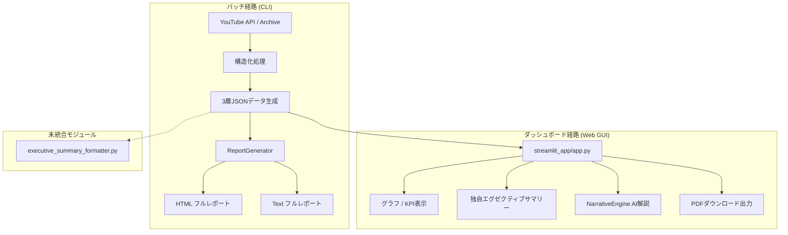

# プロジェクト概要：video-insight-spec

## ビジョン

YouTube動画の洞察・競合分析システム。動画視聴データを構造化し、経営判断に直結したレポートを自動生成・配信するSaaSサービスの基盤。

---

## フェーズの進捗

| フェーズ | タイトル | 状態 | 日付 / 実装状況 |
| :--- | :--- | :--- | :--- |
| **4.2** | データ仕様設計 | ✅ 完了 | 2026-03-26 |
| **4.3** | HTML/Text フォーマッタ | ✅ 完了 | 2026-03-27 |
| **5.1** | 経営者向けサマリー | ✅ 完了 | 2026-03-27（※ `executive_summary_formatter.py` 単体構築完了） |
| **5.2** | サブスク仕様 | ✅ 完了 | 2026-03-27 |
| **5.3** | 外部向け資料 | ✅ 完了 | 2026-03-27 |
| **6** | PoC・営業支援 | ✅ 完了 | LPメッセージング、サンプルレポート、見積自動化等 |
| **7** | プロダクト拡張 | ✅ 完了 | StreamlitによるWebダッシュボード（`streamlit_app/`）の実装および公開 `main` ブランチへの統合完了。 |

---

## フェーズ4：データ生成・レポート自動化

### 4.2 - データ仕様設計
- **目的**: 競合分析用の構造化ビュー生成
- **ビュー構成**:
  1. **Portfolio View**: 全講座のメタデータとエンゲージメント指標
  2. **Growth View**: 直近成長中の講座（スナップショット≧2件）
  3. **Theme View**: ビジネステーマごとのトップ講座
- **サンプルデータ**:
  - 分析講座数: 5本
  - ビジネステーマ数: 8個
  - テーマ別総講座数: 14本
  - エンゲージメント計算式: `0.6 × purity + 0.2 × type_weight + 0.2 × stage_weight`

### 4.3 - HTML/Text フォーマッタ
- **目的**: 3層JSONを人間が読める形式に変換
- **出力形式**:
  - **Full Report (HTML)**: Portfolio View + Growth View + Theme View + インサイト（レスポンシブCSS、セマンティックHTML、印刷対応）
  - **Full Report (テキスト)**: マークダウン互換版（メール添付、CMS連携用）
- **実装ファイル**:
  - `html_formatter.py` - レスポンシブCSSを使用したHTML生成
  - `text_formatter.py` - マークダウン変換
  - `report_generator.py` - HTML/Text バッチレポート生成のオーケストレーション

---

## フェーズ5：商品化・営業資料

### 5.1 - 経営者向けサマリー (Executive Summary)
- **モジュール実装 (`converter/executive_summary_formatter.py`)**:
  - 経営判断用のA4 1枚相当レポート（HTML/Text）を生成するモジュールは単体として実装されています。
  - **【重要】実行経路との接続状況**: 本モジュールは現在、**CLIバッチレポート生成経路（`competitor_analytics_generator.py`）および対話的ダッシュボード経路（`streamlit_app/app.py`）のどちらからも未接続**であり、パイプラインには統合されていません。
- **ダッシュボード上の独自要約**:
  - 現在、Webダッシュボードの「レポート」タブに表示されているエグゼクティブサマリーは、上記の formatter モジュールではなく、**`streamlit_app/app.py` 内で `executive_report.json` からデータをロードし、独自に Markdown テーブルで描画**しているものです。
  - また、ダッシュボード内にはこの画面要約を元に A4 相当の PDF を動的に生成してダウンロードする機能（FPDF による独自実装）が備わっています。

### 5.2 - サブスクリプション仕様
- **サービスモデル**:
  - ターゲット: EdTechスタートアップ（講座5～20本）
  - 基本プラン: 月額10万円 + 初期導入費30～50万円
  - プレミアムプラン（将来）: 月額20万円 + 週次報告
  - エンタープライズ（将来）: 要相談
- **Year 3予測 (シナリオB)**:
  - ARR: 4,500万円 / 顧客数: 30社
  - EBITDA: 1,900～2,400万円（利益率42～53%）
  - 回収期間: 3～4年

### 5.3 - 外部向け資料
- **成果物**:
  - LP構成メモ (`PHASE5_3_LP_OUTLINE.md`): マーケティング資料、CTA、料金体系
  - note記事草案 (`PHASE5_3_NOTE_DRAFT.md`): 経営層向けビジネスモデル解説
  - 金融機関向け説明書 (`PHASE5_3_FINANCE_BRIEF.md`): ピッチ資料、財務予測、リスク対策

---

## フェーズ6：PoC・営業支援

- **目標**:
  1. **PoC用ランディングページ**: サンプルレポート掲載、計算機、デモ予約
  2. **サンプルレポートセット**: 実例1～3件（HTML + テキスト）
  3. **営業テンプレ・自動化ツール**: 提案書生成、メールテンプレ、見積自動化
  4. **オンボーディング支援**: ドキュメント、チェックリスト、実装ガイド
- **成果物**:
  - `docs/phases/PHASE6_PLAN.md` - 詳細実装計画
  - `reports/samples/` - サンプルレポート
  - `sales/` - 営業テンプレ
  - `docs/onboarding/` - オンボーディング資料

---

## フェーズ7：プロダクト拡張（ローカル先行実装）

### 先行実装済み機能 (Web GUI 経路)
- **Webダッシュボード (`streamlit_app/app.py`)**:
  - キャッシュ資源（`load_executive_report`, `load_insight_specs`）による高速ロード。
  - 複合分析エンジン（`AnalyticsEngine` / `AdvancedAnalyticsEngine`）による高度な分析機能。
    - **黄金の組み合わせ検出**: 成果を生み出すパターン特定。
    - **隠れた弱点検出**: 品質とエンゲージメントのギャップ分析。
    - **心理ロードマップ**: 視聴者の心理変化に沿った最適コンテンツのロードマップ提示。
    - **競争優位性分析**: 他講座との多角的な比較スコア。
    - **次のステップ提案**: 改善アクションの自動提案。
  - **AI分析解説 (`NarrativeEngine`)**: OpenAI `gpt-4o` を活用し、メトリクスに基づくビジネス解説や推奨アクションを自然言語で動的に生成。※ `.env` に `OPENAI_API_KEY` の設定がない場合は警告表示の上、基本機能は sample data で動作。
  - **PDFダウンロード**: ダッシュボードのレポートタブより、FPDFによるPDF分析レポートをその場でダウンロード可能。

### 今後のロードマップ
- **公開 main へのマージ**: `streamlit_app/` ディレクトリの公開 `main` ブランチへのマージ・統合完了。
- **REST API**: 認証・レート制限付きデータ公開（設計完了、次期フェーズ開発予定）。
- **Slack統合**: 月次自動通知、成長テーマアラート（設計完了、次期フェーズ開発予定）。

---

## 技術アーキテクチャ

### 3層JSON構造
```json
{
  "video_meta": { "lecture_id", "title", "url", "created_at", "..." },
  "knowledge_core": { "themes", "content_type", "business_stage", "..." },
  "views": { "portfolio_view", "growth_view", "theme_view", "insights" }
}
```

### 処理パイプラインおよび実行経路


---

## セキュリティ・コンプライアンス

- **APIキー管理**: `YOUTUBE_API_KEY` および `OPENAI_API_KEY` は `.env` ファイルでローカルに管理（Git非追跡）。
- **データ暗号化**: 通信中（TLS）+ 保存時。
- **個人情報保護**: GDPR 準拠の匿名化処理により、顧客データに PII（個人を特定できる情報）は一切含まれません。
- **SLA**: 稼働率99.9%を目指す。
